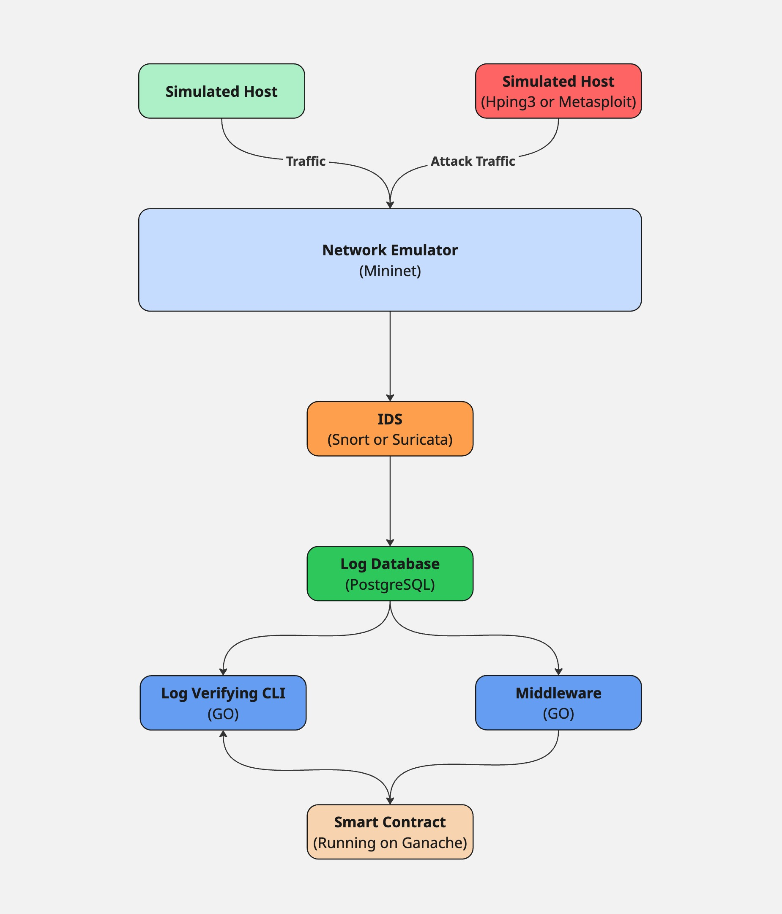

# Blockchain-Based Intrusion Detection System: Securing Alert Logs with Ethereum

## 1. Introduction
This project presents a real-time Intrusion Detection and Logging System that combines **Snort IDS**, **PostgreSQL** for storage, and **Ethereum blockchain** for secure alert logging. The system simulates a network using **Mininet**, detects malicious behavior using Snort, stores alerts in PostgreSQL, and securely hashes and logs alerts to a smart contract using a **Golang middleware**. An admin can compare the alert hashes from on-chain smart contract with hashing the alerts from postgresql database.

## 2. System Architecture

### 2.1 Network Topology
The network consists of three nodes in a Mininet simulation:

- `h1`: victim node  
- `h2`: another victim node  
- `attacker`: sends various types of malicious traffic

All nodes are connected via an OVS switch (`s1`) in a flat topology.

### 2.2 Components

**Snort IDS**:
- Runs on both `h1` and `h2`
- Uses custom rules to detect ICMP flood, SYN flood, UDP flood, and port scan attacks
- Logs alerts in `fast` format to local log files

**PostgreSQL Database**:
- Stores alerts in a table named `snort_alerts` with the following schema:

```sql
CREATE TABLE snort_alerts (
    id SERIAL PRIMARY KEY,
    timestamp TIMESTAMP DEFAULT CURRENT_TIMESTAMP,
    log_source TEXT,
    alert_text TEXT
);
```

**Golang Middleware**:
- Connects to the PostgreSQL database
- Periodically checks for new alerts
- Hashes alert text using SHA-256
- Sends hashes to a deployed Ethereum smart contract via Go-Ethereum bindings

**Ethereum Smart Contract**:
- Receives hashed alerts via a `logAlert(uint256 id, string message)` function
- Records each hash as a transaction for immutability
- Only the contract owner can write to it

```solidity
// SPDX-License-Identifier: MIT
pragma solidity ^0.8.0;

contract SnortLogger {
    event AlertLogged(uint256 id, address sender, string hash);

    struct Alert {
        address sender;
        string hash;
    }

    mapping(uint256 => Alert) public alerts;
    uint256[] public ids;
    address public owner;

    modifier onlyOwner() {
        require(msg.sender == owner, "Only contract owner can log alerts");
        _;
    }

    constructor() {
        owner = msg.sender;
    }

    function logAlert(uint256 id, string memory hash) public onlyOwner {
        require(bytes(alerts[id].hash).length == 0, "Alert ID already logged");
        alerts[id] = Alert(msg.sender, hash);
        ids.push(id);
        emit AlertLogged(id, msg.sender, hash);
    }

    function getAlert(uint256 id) public view returns (address, string memory) {
        Alert memory a = alerts[id];
        return (a.sender, a.hash);
    }

    function getAllIds() public view returns (uint256[] memory) {
        return ids;
    }
}
```

### 2.3 Architecture
<p align="center">
  
</p>

## 3. Implementation Details

### 3.1 Snort Setup

Snort is configured with:
- Custom rules in `/etc/snort/rules/local.rules`
- Output using:
```bash
output alert_fast
```
- Launched with:
```bash
snort -A fast -i h1-eth0 -c /etc/snort/snort.conf -l /tmp/snort_logs_h1
```

### 3.2 Attack Simulation

Attacks are generated using a Python script:
- ICMP flood via `ping`
- SYN flood via `hping3 -S`
- UDP flood via `hping3 --udp`
- Port scan via `nmap -Pn -sS`

### 3.3 Database Logger

A Python daemon monitors Snort alert files:
- Reads new lines from logs
- Inserts them into PostgreSQL with metadata

### 3.4 Go Middleware

- Connects to PostgreSQL using `github.com/lib/pq`
- Queries new rows using the latest `id`
- Hashes each `alert_text` using SHA-256
- Calls `logAlert(timestamp, message)` on the smart contract
- Handles gas and nonce management

### 3.5 Go Alert Verifying Console

- Admins enter an alert id from database.
- The relevant alarm is retrieved from the database and concateated with timestamp and finally hashed.
- Admins call `GetAlert(id)` on the smart contract and get the hash of the corresponding alert.
- Finally, admins compare these two hashes and verify that the alert is not altered.

## 4. Technologies Used

- Mininet (network simulation)
- Snort (open-source IDS)
- PostgreSQL (database)
- Go (blockchain middleware)
- Solidity (smart contract)
- Hardhat (smart contract developlent)
- Ganache (Ethereum simulator)
- Go-Ethereum (Binding the smart contracts with abigen)

## 5. Conclusion

This system creates a secure and auditable pipeline for Snort alerts by combining network simulation, intrusion detection, traditional database logging, and blockchain verification.